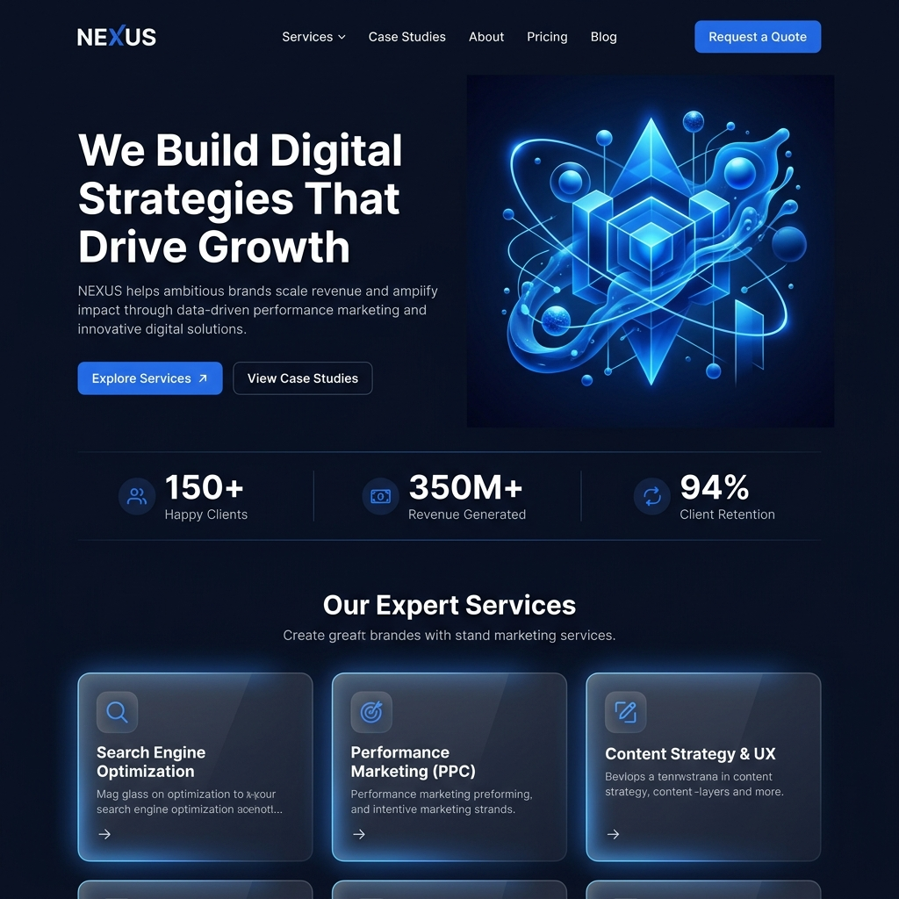

# Diziti — Modern SEO & Digital Agency WordPress Theme

Diziti is a high-performance, visually stunning WordPress theme designed specifically for SEO agencies, digital marketing firms, and SaaS startups. Built with a focus on "Digital Marketing" aesthetics, it combines modern tech-oriented typography, glassmorphism elements, and high-tech 3D visuals to create a premium brand experience.



## 🚀 Key Features

- **Dynamic Transparent Header**: A sophisticated header that starts transparent and transitions to a blurred solid background with glassmorphism effects on scroll.
- **Hero Split Layout**: High-impact hero section featuring bold typography and custom-generated 3D abstract illustrations.
- **Glassmorphism Service Cards**: Interactive grid layout using modern glass effects, backdrop filters, and smooth hover micro-animations.
- **Masonry Portfolio**: A "Case Studies" section with a masonry layout to showcase your work in a clean, professional grid.
- **Interactive Elements**: Scroll-triggered reveal animations and animated counters for project stats.
- **Premium Typography**: Perfectly paired 'Inter' and 'Plus Jakarta Sans' fonts for a high-tech, clean look.
- **Fully Responsive**: Built on Bootstrap 5 for a mobile-first, flawless experience across all devices.
- **SEO Optimized**: Lightweight codebase with semantic HTML5 and pre-optimized meta tags for search engines.

## 🛠️ Technical Stack

- **Core**: WordPress, PHP
- **Styling**: Vanilla CSS (Modern Design Tokens)
- **Framework**: Bootstrap 5 (Responsiveness)
- **Typography**: Google Fonts (Inter, Plus Jakarta Sans)
- **Icons**: FontAwesome 6
- **Interactions**: Vanilla JS (No jQuery dependency)

## 📂 Folder Structure

```text
diziti/
├── assets/
│   ├── images/         # Theme-specific illustrations and backgrounds
│   └── js/             # Custom interaction logic (main.js)
├── footer.php          # Global footer template
├── front-page.php      # Main landing page template
├── functions.php       # Core theme setup and asset enqueuing
├── header.php          # Global header with scroll logic
├── index.php           # Fallback blog template
├── screenshot.png      # Theme preview for WordPress Dashboard
└── style.css           # Design system tokens and component styles
```

## ⚙️ Installation

1. **Upload**: Zip the `diziti` folder or copy it directly to your WordPress installation: `wp-content/themes/diziti`.
2. **Activate**: Go to `Appearance > Themes` in your WordPress admin dashboard and click **Activate** on Diziti.
3. **Setup**:
   - Ensure you have the **Advanced Custom Fields (ACF)** plugin if you wish to extend the front-page content dynamically (optional).
   - Assign a menu to the **Primary Menu** location in `Appearance > Menus`.
   - Set your homepage to "Latest Posts" or select a static page; the `front-page.php` will automatically handle the layout.

## 📄 License

This theme is licensed under the GPL-2.0-or-later license.

---
*Crafted for high-conversion and premium digital presence.*
